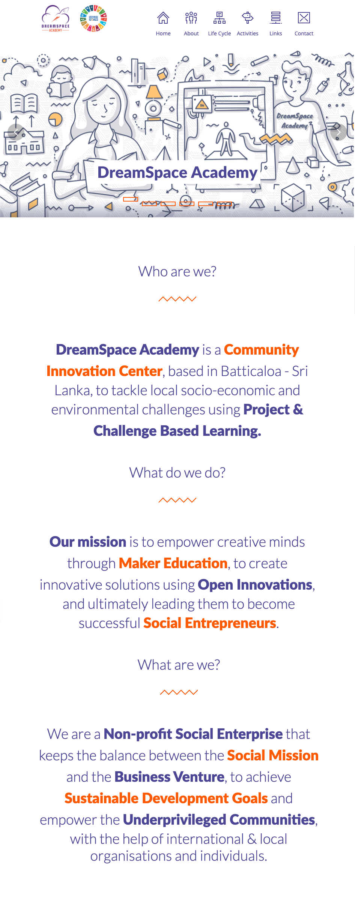

# www.dreamspace.academy

## AUTHOR
  - Aravinth Panch

## CONTRIBUTORS
  - Viththiyakaran Nadarajah
  - Shankarie Sritharan
  - Jayanthan Amalanathan
  - Guna Rahulan

## DEVELOPMENT SETUP
- Setup Git
  - Create GitHub account
  - Create SSH key on the local computer and add the public key to the GitHub account
  - Join DreamSpace GitHub Organisation at https://github.com/dreamspace-academy
- Setup Development Environment
  - Install Atom IDE at https://atom.io
  - Install Atom packages php-fmt, php-server, atom-beautify
